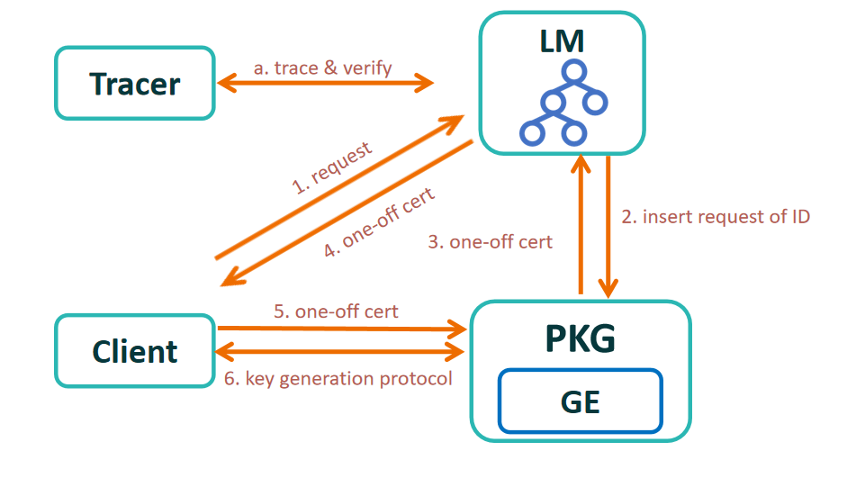

<head>
    
    
    
</head>

## What is **Portex**?

Accountability provides a fundamental **after-the-fact** approach to detecting and possibly punishing illegal actions in cryptosystems. However, making decryption accountable is tricky. The decryption is normally conducted by end-users locally, where a decrypter may refuse to provide auditable information on his decryption. In this paper, we propose a novel accountable decryption system, called **Portex** using trusted hardware. Each decryption is forced to generate a publicly verifiable log, making the user's decryption accountable. Meanwhile, we introduce a tracing mechanism to guarantee that the attacks on trusted hardware are traceable. The formal model, security analysis, and prototype implementation as well as comprehensive evaluations demonstrate that our scheme is provably secure and practically feasible.

## Contributions

- We propose a practical accountable cryptosystems, in which the users are accountable for their decryption. Each
  decryption will be faithfully recorded by the log maintainer, whose actions are publicly verifiable.
- Our proposed scheme relies on TEE, but we further take consider the mainstream vulnerability of TEE that may leak the
  users' private keys and destroy accountability. We accordingly design a tracing mechanism to make trusted hardware,
  additionally, accountable for the private key generation and distribution.
- We formalize the syntax and security definitions of **Portex**. The formal security analyses indicate that our system
  is provably secure, which satisfies the properties of *key privacy*, *fairness*, *completeness*, and *TEE
  traceability*.
- We provide a full-functional implementation for **Portex** and evaluate performance in terms of *theoretical
  complexity*, *running time*, and *log size* for major functionalities. The experimental results demonstrate the
  feasibility and efficiency of our system.

## People

- Yuanzhao Li (Southern University of Science and Technology)
- Rujia Li (Tsinghua University)
- Qing Wang (Data61, CSIRO)
- Sisi Duan (Tsinghua University)
- Qi Wang (Southern University of Science and Technology)
- Mark Ryan (University of Birmingham)

    

        
        
        
        
    

## Designs

In **Portex**, four types of entities are involved: *private key generator* $\mathsf{PKG}$, a *log manager*
$\mathsf{LM}$, and user clients $\mathsf{CLIENTS}$ and tracers $\mathsf{TRACERS}$. The $\mathsf{PKG}$ is required to run
inside TEEs. The log manager and users' platforms do not necessarily to support TEEs. Similar to the standard IBE
system, the $\mathsf{PKG}$ is responsible for generating the public parameters and extracting and distributing the
user's private key. User clients $\mathsf{CLIENTS}$ are used to perform the decryption of ciphertext. The $\mathsf{LM}$
updates and stores the logs when $\mathsf{PKG}$ distributes a private key. $\mathsf{TRACERS}$ that any roles can serve
are responsible for detecting the wrongdoing of $\mathsf{CLIENTS}$ and the TEE-based $\mathsf{PKG}$ and users. The main
idea behind **Portex** is to run $\mathsf{PKG}$ inside a TEE and force the action of key generation to render a public
auditable log.

## Implementation

The implementation is published in [Portex-tee/Portex (github.com)](https://github.com/Portex-tee/Portex)

Here we present the functions:

    

        

            <video class="video" controls="controls">
                <source src="media/keyreq.mkv" type="video/mp4" />
                Your browser does not support the video tag.
            </video>
            <h3> Key Request </h3>
        

        

            <video class="video" controls="controls">
                <source src="media/keyreq.mkv" type="video/mp4" />
                Your browser does not support the video tag.
            </video>
            <h3> Key Generation </h3>
        

    

    

        

            <video class="video" controls="controls">
                <source src="media/encrypt.mkv" type="video/mp4" />
                Your browser does not support the video tag.
            </video>
            <h3> Encryption </h3>
        

        

            <video class="video" controls="controls">
                <source src="media/decrypt.mkv" type="video/mp4" />
                Your browser does not support the video tag.
            </video>
            <h3> Decryption </h3>
        

    

    

        

            <video class="video" controls="controls">
                <source src="media/logtrace.mkv" type="video/mp4" />
                Your browser does not support the video tag.
            </video>
            <h3> Log Trace </h3>
        

        

            <video class="video" controls="controls">
                <source src="media/teeinspect.mkv" type="video/mp4" />
                Your browser does not support the video tag.
            </video>
            <h3> TEE Inspect </h3>
        

    

